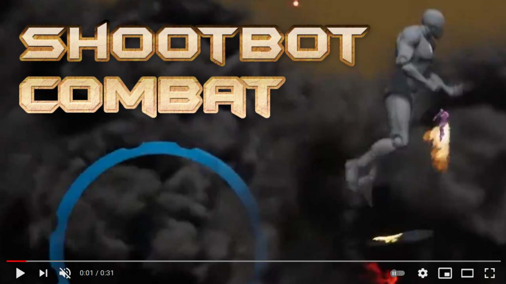

# ShootbotCombat

Inspired by Metal Warriors (1995, SNES).

The missile projectiles are by [Jason Frailey](http://jasonfrailey.com) as he was learning zbrush.

Developed as a hobby project in Unreal Engine 4 in August 2019.

# Dev Notes

[Dev_NOTES.md](Documentation/Dev_NOTES.md) contains things related to character scale, 2D plan locations,etc.

